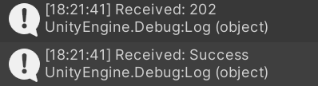

# AppsFlyer Unity Epic Integration

## **Getting started with AppsFlyer Unity Epic Integration**

AppsFlyer empowers marketers to make better decisions by providing game marketers with powerful tools to perform cross-platform attribution.
Game attribution requires the game to integrate an AppsFlyer SDK, which handles first open, consecutive sessions, and in-app events. For example, purchase events.

We recommend you use this sample app as a reference for integrating AppsFlyer SDK into your Unity-Epic game.

<hr/>

## **AppsflyerEpicModule - Interface**

`AppsflyerEpicModule.cs`, included in the scenes folder, contains the required code and logic to connect to our servers and report events.

### `AppsflyerEpicModule(string appid, string devkey)`

This method receives your api key and app id, and initializes the AppsFlyer Module.

_Usage_:

```
AppsflyerEpicModule afm = new AppsflyerEpicModule("EPIC_APP_ID", "DEV_KEY");
```

_Arguments_:

- EPIC_APP_ID - you may find your app in the epic store link
- DEV_KEY - retrieve the Dev key from the marketer or the [AppsFlyer HQ](https://support.appsflyer.com/hc/en-us/articles/211719806-App-settings-#general-app-settings).

### `public void Start()`

sends "first open/session" request to AppsFlyer.

_Usage_:

```
afm.Start();
```

### `public void LogEvent(string event_name, string event_values)`

This method receives an event name and json object and sends an in-app event to AppsFlyer.

_Usage_:

```
//set event name
string event_name = "af_purchase";
//set json string
string event_values = "{\"af_currency\":\"USD\",\"af_price\":6.66,\"af_revenue\":24.12}";
afm.LogEvent(event_name, event_values);
```

## Running the Sample App

1. Open Unity hub and open the project.
2. Use the sample code in AppsflyerEpicScript.cs and update it with your DEV_KEY and APP_ID.
3. Add the AppsflyerEpicScript to an empty game object (or use the one in the scenes folder):
   
4. Launch the sample app via the Unity editor and check that your debug log shows the following message:
   
5. After 24 hours, the dashboard will update and show organic/non-organic install and in-app events.
